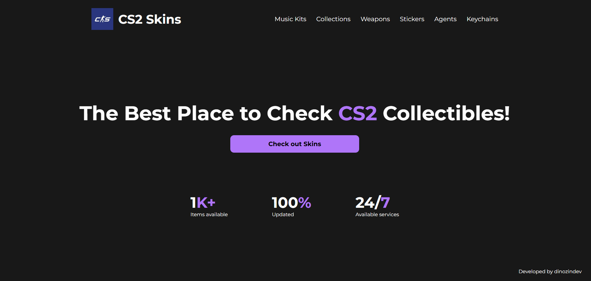

# CS2 Skins

A website where users are able to search for CS2 cosmetic items. The items are fetched through the [ByMykel CSGO-API](https://github.com/ByMykel/CSGO-API).

Users are able to look for:

- Music Kits
- Weapon Skins
- Collections
- Keychains
- Stickers
- Agents


## Instalation

To run the application, you need to:

- Open the project on an IDE and type on terminal:

```js
npm install
```
- After that, type:
```js
npm run dev
```

## Tecnologies used

- TypeScript
- React
- styled-components

## Screenshots




